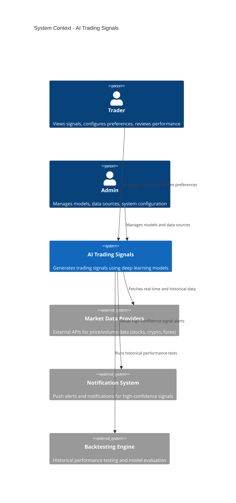

# AI Trading Signals - System Context

## System Overview
An AI-powered trading signal generation system that ingests market data from multiple sources, applies deep learning models (LSTM/transformers), and delivers actionable buy/sell/hold signals to traders via dashboard and notifications.

## Context Diagram

## External Integrations

- **Market Data Providers**: Multiple aggregated sources for stocks, crypto, and forex price/volume data
- **Notification System**: Push alerts for high-confidence signals via dashboard and configured channels
- **Backtesting Engine**: Automated historical performance testing and model evaluation against historical data

## High-Level Constraints

- Must use existing Supabase PostgreSQL for signal and performance data storage
- ML models deployable via FastAPI
- Frontend dashboard built with Next.js

## Key NFR Goals

- Signal generation latency < 1 second
- Support 1,000+ concurrent dashboard users
- 99.5% uptime for signal generation service
- Deep learning model inference optimized for real-time performance
